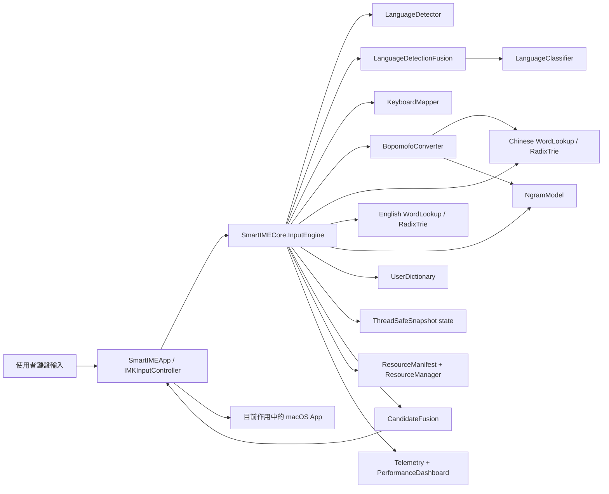
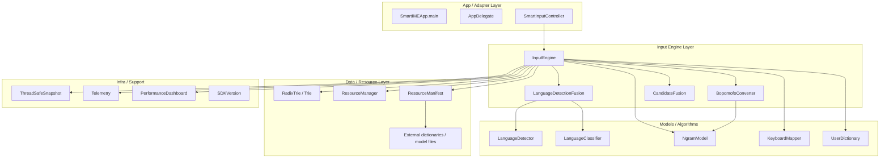
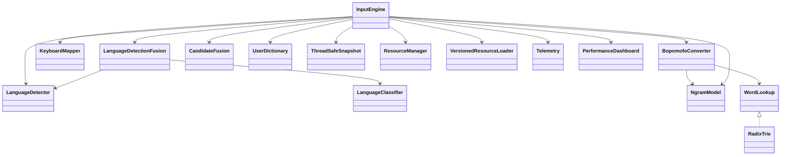
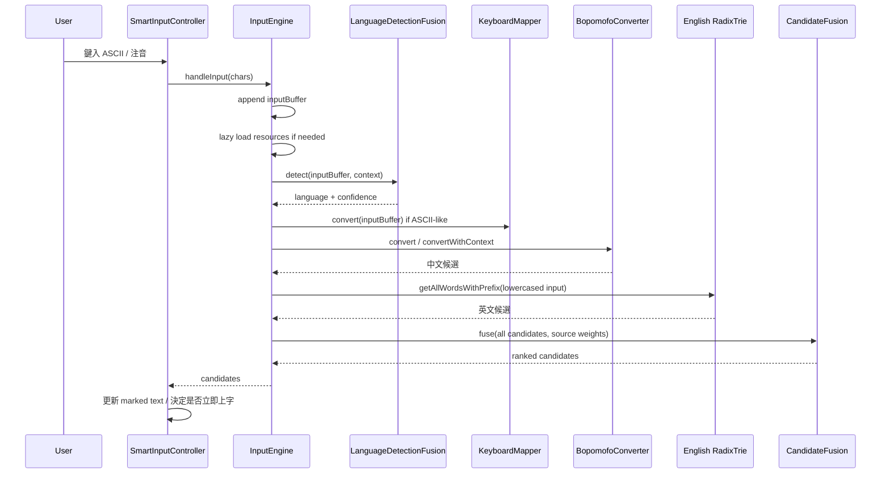
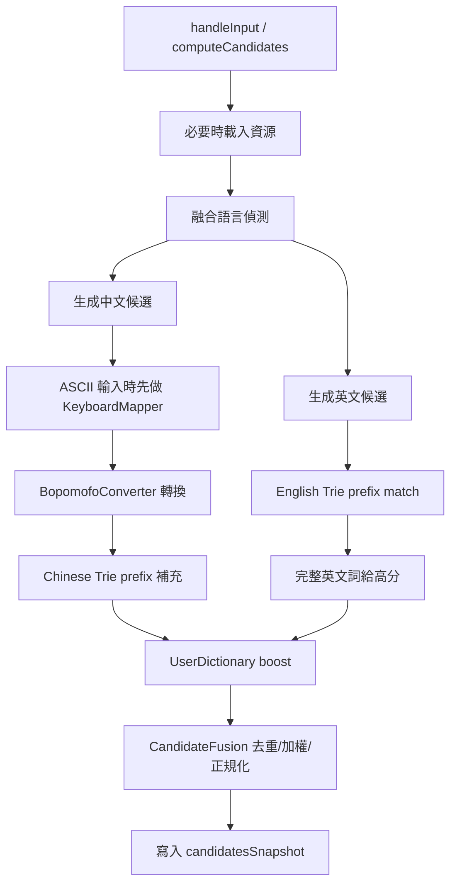
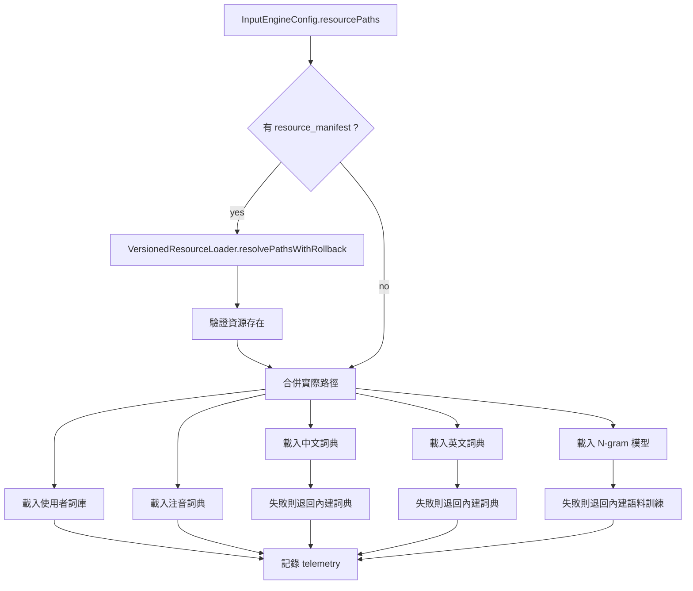
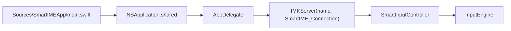
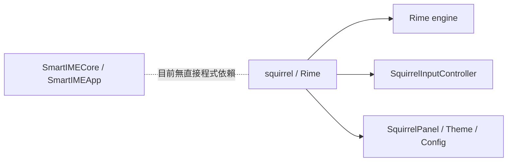
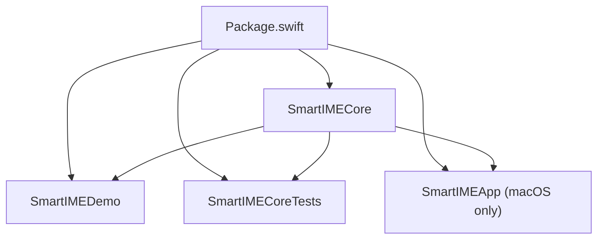

# Smart Input Method 架構文檔

## 1. 文檔目的

這份文檔以目前 repo 內「實際可編譯與可執行」的程式碼為準，整理 Smart Input Method 的完整架構、模組邊界、資料流、執行流程、資源管理、建置關係與部署形態。

重點不是描述理想設計，而是描述現在這個專案實際長什麼樣、怎麼跑、哪些目錄是主線、哪些是歷史或參考資產。

## 2. 系統總覽

Smart Input Method 是一個以 Swift 撰寫的混合輸入法專案，主要包含三條線：

1. `SmartIMECore`
   負責輸入引擎、語言偵測、注音轉換、候選融合、詞典與語言模型。
2. `SmartIMEApp`
   macOS `InputMethodKit` 包裝層，負責接收鍵盤事件、更新組字區、提交候選詞。
3. `SmartIMEDemo`
   CLI 示範程式，用來驗證核心引擎行為。

另外 repo 也包含一份完整的 `squirrel/`，那是一套獨立的 Rime/Squirrel 輸入法實作，不依賴 `SmartIMECore`，更像平行參考系統與上游整合素材。

## 3. 實際編譯目標

根據 [Package.swift](/Users/jaywang/Desktop/smart_input_method/Package.swift:1)，目前主動 target 如下：

| Target | 類型 | 來源目錄 | 用途 |
| --- | --- | --- | --- |
| `SmartIMECore` | library | `Sources/SmartIMECore` | 核心輸入邏輯 |
| `SmartIMEDemo` | executable | `Sources/SmartIMEDemo` | CLI 示範 |
| `SmartIMECoreTests` | executable | `Tests/UnitTests.swift` | 輕量測試 harness |
| `SmartIMEApp` | executable, macOS only | `Sources/SmartIMEApp` | `InputMethodKit` 應用入口 |

## 4. Repo 版圖

### 4.1 主要目錄

```text
smart_input_method/
├── Sources/
│   ├── SmartIMECore/      # 主線核心程式碼
│   ├── SmartIMEApp/       # macOS InputMethodKit 包裝
│   └── SmartIMEDemo/      # CLI 示範
├── Tests/                 # 輕量測試
├── squirrel/              # 獨立的 Rime/Squirrel 實作
├── README.md
├── Package.swift
└── 各類設計/使用文件
```

### 4.2 歷史或鏡像目錄

repo 根目錄下也有 `Core/`、`DataStructures/`、`ML/`、`macOS/` 等資料夾，內容與 `Sources/SmartIMECore` / `Sources/SmartIMEApp` 有大量重複或鏡像。  
目前 Swift Package Manager 的編譯入口不是這些目錄，而是 `Sources/...`。

結論：

- 若要理解實際執行邏輯，優先讀 `Sources/`
- 根目錄的同名 Swift 檔較像歷史版本、備份或遷移過程中的鏡像

## 5. 高階架構圖



## 6. 執行時分層



## 7. 核心模組說明

### 7.1 `InputEngine`

檔案：
[InputEngine.swift](/Users/jaywang/Desktop/smart_input_method/Sources/SmartIMECore/InputEngine.swift:1)

`InputEngine` 是整個核心的 orchestration layer，負責：

- 管理輸入緩衝區
- 維護上下文詞序列
- 觸發資源載入
- 同時產生中文與英文候選
- 根據語言偵測結果動態加權
- 融合去重排序
- 學習使用者選字
- 對外提供同步與非同步 API

重要內部狀態：

- `inputBufferSnapshot`
- `contextWordsSnapshot`
- `candidatesSnapshot`
- `resourcesLoaded`
- `requestSerial`

這些狀態不是裸露變數，而是透過 `ThreadSafeSnapshot` 和少量鎖保護。

### 7.2 `LanguageDetector`

檔案：
[LanguageDetector.swift](/Users/jaywang/Desktop/smart_input_method/Sources/SmartIMECore/LanguageDetector.swift:1)

這是規則式偵測器，依據下列特徵判斷語言：

- 注音比例
- ASCII 字母比例
- 中文字比例
- 數字比例
- 常見英文單詞命中率
- 上下文語言傾向
- 使用者歷史偏好
- 字串長度特徵

輸出為：

- `language`
- `confidence`
- `features`

### 7.3 `LanguageClassifier`

檔案：
[LanguageClassifier.swift](/Users/jaywang/Desktop/smart_input_method/Sources/SmartIMECore/LanguageClassifier.swift:1)

這是簡化版的統計分類器，行為近似朴素貝葉斯 / 特徵加權分類器。  
它不是獨立取代規則偵測，而是提供第二意見。

### 7.4 `LanguageDetectionFusion`

檔案：
[LanguageDetectionFusion.swift](/Users/jaywang/Desktop/smart_input_method/Sources/SmartIMECore/LanguageDetectionFusion.swift:1)

這一層把：

- 規則式偵測 `LanguageDetector`
- 統計分類 `LanguageClassifier`

融合成單一結果，並維護可調參數：

- `ruleThreshold`
- `ruleWeight`
- `classifierWeight`

這讓系統不是「硬切中文路徑 / 英文路徑」，而是先估權重再影響候選排序。

### 7.5 `KeyboardMapper`

檔案：
[KeyboardMapper.swift](/Users/jaywang/Desktop/smart_input_method/Sources/SmartIMECore/KeyboardMapper.swift:1)

負責將英文鍵盤按鍵映射為注音符號，例如：

- `s -> ㄋ`
- `u -> ㄧ`
- `3 -> ˇ`

因此像 `su3cl3` 會先被映射為注音，再送入中文候選生成。

### 7.6 `BopomofoConverter`

檔案：
[BopomofoConverter.swift](/Users/jaywang/Desktop/smart_input_method/Sources/SmartIMECore/BopomofoConverter.swift:1)

職責：

- 維護注音到中文字/詞的映射
- 提供無上下文與有上下文的轉換
- 利用 `NgramModel` 提升上下文相符候選的分數
- 與中文 `WordLookup` 配合做候選展開

這個檔案是目前核心中最大的詞典/映射與轉換實作。

### 7.7 `NgramModel`

檔案：
[NgramModel.swift](/Users/jaywang/Desktop/smart_input_method/Sources/SmartIMECore/NgramModel.swift:1)

功能：

- 訓練 unigram / bigram / trigram
- 以 log domain 計算機率
- 對 bigram 採 Kneser-Ney 風格平滑
- 對 trigram 採 absolute discount + backoff
- 支援模型存檔與載入

這一層主要用於：

- 注音轉換上下文評分
- `getSuggestions()` 的下一詞預測

### 7.8 `WordLookup` / `Trie` / `RadixTrie`

檔案：

- [WordLookup.swift](/Users/jaywang/Desktop/smart_input_method/Sources/SmartIMECore/WordLookup.swift:1)
- [Trie.swift](/Users/jaywang/Desktop/smart_input_method/Sources/SmartIMECore/Trie.swift:1)
- [RadixTrie.swift](/Users/jaywang/Desktop/smart_input_method/Sources/SmartIMECore/RadixTrie.swift:1)

`WordLookup` 是抽象介面。  
目前 `InputEngine` 實際使用的是 `RadixTrie()` 來作為中文與英文詞典容器。

`Trie`
- 結構較直觀
- 適合教學與測試

`RadixTrie`
- 使用壓縮前綴邊
- 內建 prefix LRU cache
- 用來支撐較實際的 prefix lookup

### 7.9 `CandidateFusion`

檔案：
[CandidateFusion.swift](/Users/jaywang/Desktop/smart_input_method/Sources/SmartIMECore/CandidateFusion.swift:1)

負責：

- 多來源候選去重
- 套用 source weight
- min-max 正規化
- 依分數排序並截斷數量

### 7.10 `UserDictionary`

檔案：
[UserDictionary.swift](/Users/jaywang/Desktop/smart_input_method/Sources/SmartIMECore/UserDictionary.swift:1)

功能：

- 記錄使用者選字頻次
- 對既有候選分數做 boost
- 每日衰退，避免早期偏好永久鎖死
- 可保存/讀取到外部 JSON

### 7.11 `ResourceManager` / `ResourceManifest`

檔案：

- [ResourceManager.swift](/Users/jaywang/Desktop/smart_input_method/Sources/SmartIMECore/ResourceManager.swift:1)
- [ResourceManifest.swift](/Users/jaywang/Desktop/smart_input_method/Sources/SmartIMECore/ResourceManifest.swift:1)

用途：

- 從外部路徑載入詞典與模型
- 支援 memory-mapped 讀取大型資源
- 支援 `resource_manifest`
- manifest 驗證失敗時可回滾到 `rollbackManifestPath`

### 7.12 觀測與效能

檔案：

- [Telemetry.swift](/Users/jaywang/Desktop/smart_input_method/Sources/SmartIMECore/Telemetry.swift:1)
- [PerformanceDashboard.swift](/Users/jaywang/Desktop/smart_input_method/Sources/SmartIMECore/PerformanceDashboard.swift:1)

目前是本地型 observability：

- `Telemetry` 做抽樣事件輸出
- `PerformanceDashboard` 累積延遲、QPS、命中率、SLA 檢查

## 8. 類別依賴圖



## 9. 關鍵輸入流程

### 9.1 同步輸入處理流程



### 9.2 不是單一分支，而是雙路生成

這個系統最重要的行為特徵是：

- 不是先判斷中文或英文，再只跑一條路
- 而是「中文候選」和「英文候選」都生成
- 語言偵測結果只影響加權與排序

因此它對混合輸入更寬容，也更容易做 fallback。

### 9.3 候選生成流程圖



## 10. 候選提交與學習流程

`SmartInputController` 並不是無條件提交第一名，而是依據輸入型態做 commit 策略：

- 若有注音提示鍵或聲調線索，優先上中文字
- 若是 ASCII 單字且存在完整英文匹配，偏向英文
- 若中文候選分數遠大於英文，仍可壓過英文
- 都不可靠時，提交 raw input

對應檔案：
[SmartInputController.swift](/Users/jaywang/Desktop/smart_input_method/Sources/SmartIMEApp/SmartInputController.swift:1)

提交後：

1. 選中的詞會寫入 context
2. `UserDictionary.learn()` 增加偏好
3. 若設定 `user_dict` 路徑，會持久化

## 11. 資源載入架構



目前 `InputEngine` 內建了：

- 中文詞典樣本
- 英文詞典樣本
- 注音映射
- 一批訓練語料

所以即使沒有外部資源檔，系統仍可運作，只是規模與準確度有限。

## 12. 並行與執行緒安全設計

### 12.1 狀態保護

`InputEngine` 內部狀態使用 `ThreadSafeSnapshot<T>`：

- 讀取用 `pthread_rwlock_rdlock`
- 寫入用 `pthread_rwlock_wrlock`
- 適合讀多寫少的輸入法狀態

保護對象：

- 當前輸入 buffer
- context words
- candidates

### 12.2 非同步候選

`InputEngine` 提供：

- `handleInputAsync`
- `deleteLastCharacterAsync`

其設計重點：

- 工作在 `workQueue`
- 以 `requestSerial` 只發布最新請求結果
- 避免舊結果覆蓋新輸入

### 12.3 其他併發點

- `UserDictionary` 使用 concurrent queue + barrier 寫入
- `LanguageDetectionFusion` 的可學習參數也用 queue 保護
- `PerformanceDashboard` 採 concurrent queue 記錄樣本

## 13. macOS InputMethodKit 整合

### 13.1 啟動鏈



### 13.2 事件處理責任

`SmartInputController` 負責：

- 接收 keyDown / delete / enter / space
- 呼叫 `InputEngine.handleInput()` / `deleteLastCharacter()`
- 用 `compositionString` 更新 marked text
- 依規則決定 `commitBestCandidate()`
- 在停用輸入法時 `commitComposition()`

### 13.3 UI 表面

目前主實作偏向：

- marked text 更新
- 自動上字
- 基本 log

`candidatesWindow` 變數存在，但完整候選窗仍屬輕量實作，沒有形成大型 UI 子系統。

## 14. CLI Demo 與測試

### 14.1 `SmartIMEDemo`

檔案：
[IMEDemo.swift](/Users/jaywang/Desktop/smart_input_method/Sources/SmartIMEDemo/IMEDemo.swift:1)

用途：

- 展示注音轉換
- 展示英文補全
- 展示語言偵測
- 展示上下文建議
- 展示混合輸入

### 14.2 `SmartIMECoreTests`

檔案：
[UnitTests.swift](/Users/jaywang/Desktop/smart_input_method/Tests/UnitTests.swift:1)

這不是 XCTest，而是自製輕量 test harness。  
目前覆蓋：

- `Trie`
- `RadixTrie`
- `NgramModel`
- `LanguageDetector`
- `InputEngine`
- `KeyboardMapper`
- 英文補全
- 注音聲調案例

## 15. Squirrel 子專案的位置

`squirrel/` 不是 `SmartIMECore` 的 adapter，而是一套獨立輸入法系統。

### 15.1 它的角色

- 提供 Rime/Squirrel 的完整 macOS 實作
- 可作為成熟輸入法的參考架構
- 也可能是未來整合或借鏡的基礎

### 15.2 與主線的關係



### 15.3 Squirrel 啟動鏈

參考：

- [squirrel/sources/Main.swift](/Users/jaywang/Desktop/smart_input_method/squirrel/sources/Main.swift:1)
- [squirrel/sources/SquirrelInputController.swift](/Users/jaywang/Desktop/smart_input_method/squirrel/sources/SquirrelInputController.swift:1)

Squirrel 的架構核心是：

- `IMKServer`
- `SquirrelApplicationDelegate`
- `SquirrelInputController`
- `RimeApi_stdbool`

也就是它走的是「Swift UI / IMK 外殼 + Rime C API 引擎」模式，和 `SmartIMECore` 這種純 Swift 自製引擎不同。

## 16. 建置與部署視角

### 16.1 建置圖



### 16.2 產物角色

- `SmartIMECore`
  可重用 library
- `SmartIMEDemo`
  本地驗證與展示
- `SmartIMEApp`
  真正接到 macOS IMK 的輸入法宿主
- `squirrel/`
  另一套獨立產品線與安裝腳本

## 17. 目前實作規模

依目前 repo 內實際 Swift 檔粗估：

- `Sources/SmartIMECore`: 約 4602 行
- `Sources/SmartIMEApp`: 約 276 行
- `Sources/SmartIMEDemo`: 約 271 行
- `Tests`: 約 253 行
- `squirrel/sources`: 約 3217 行

這也說明目前主線複雜度主要集中在：

- `InputEngine.swift`
- `BopomofoConverter.swift`
- `NgramModel.swift`
- `SquirrelInputController.swift`（若納入平行系統觀察）

## 18. 目前架構特徵總結

### 18.1 優點

- 核心與平台 adapter 已分離
- 中英文候選雙路生成，fallback 友善
- 支援外部資源與 manifest 回滾
- 有基本執行緒安全設計
- 有 demo 與可執行測試入口

### 18.2 目前限制

- 大量內建詞典/語料仍寫死在程式內
- `BopomofoConverter` 檔案很大，責任偏重
- `SmartInputController` 的 commit policy 與 UI policy 還耦合在一起
- repo 中存在鏡像/歷史目錄，容易混淆來源
- `squirrel/` 與主線並列，但沒有明確文件說明兩者邊界

## 19. 建議閱讀順序

如果要最快理解這個專案，建議依序讀：

1. [Package.swift](/Users/jaywang/Desktop/smart_input_method/Package.swift:1)
2. [InputEngine.swift](/Users/jaywang/Desktop/smart_input_method/Sources/SmartIMECore/InputEngine.swift:1)
3. [LanguageDetectionFusion.swift](/Users/jaywang/Desktop/smart_input_method/Sources/SmartIMECore/LanguageDetectionFusion.swift:1)
4. [BopomofoConverter.swift](/Users/jaywang/Desktop/smart_input_method/Sources/SmartIMECore/BopomofoConverter.swift:1)
5. [NgramModel.swift](/Users/jaywang/Desktop/smart_input_method/Sources/SmartIMECore/NgramModel.swift:1)
6. [SmartInputController.swift](/Users/jaywang/Desktop/smart_input_method/Sources/SmartIMEApp/SmartInputController.swift:1)
7. [Tests/UnitTests.swift](/Users/jaywang/Desktop/smart_input_method/Tests/UnitTests.swift:1)
8. 若要比較成熟輸入法實作，再看 [squirrel/sources/Main.swift](/Users/jaywang/Desktop/smart_input_method/squirrel/sources/Main.swift:1)

## 20. 一句話版本

這個 repo 的主線架構是「`SmartIMECore` 純 Swift 輸入引擎 + `SmartIMEApp` 的 macOS InputMethodKit 外殼」，核心策略不是先二選一語言，而是同時生成中英文候選，再透過語言偵測、N-gram、詞頻與使用者詞典去做融合排序；`squirrel/` 則是並列存在的另一套 Rime/Squirrel 參考系統。

## 21. 資工終極延伸定位

如果要把這個專案包裝成「資工相關的終極延伸」，最有說服力的角度不是只說它是輸入法，而是把它定義成：

「一個結合作業系統整合、演算法、自然語言處理、資料結構、機器學習、軟體工程與人機互動的智慧型系統工程專題。」

### 21.1 為什麼它很像資工總整

這個題目同時踩到多個資工核心領域：

- 系統程式
  直接整合 macOS `InputMethodKit`，要處理系統層事件、輸入法生命週期與應用程式互動。
- 資料結構
  使用 `Trie` / `RadixTrie` 做 prefix lookup、壓縮儲存與查詢優化。
- 演算法
  候選生成、分數融合、回退策略、平滑方法、上下文預測都屬演算法設計。
- 機率模型與 NLP
  使用 `NgramModel`、語言偵測、注音到中文字詞轉換，屬自然語言處理範疇。
- 機器學習
  `LanguageClassifier` 與 `LanguageDetectionFusion` 展示了規則式與學習式方法的混合。
- 併發與效能
  非同步候選、快照狀態、延遲量測與 SLA 指標，對應高互動系統的效能工程。
- 軟體工程
  專案切成 core library、demo、macOS app、測試與資源管理，具有模組化架構。
- 人機互動
  輸入法本身就是高頻人機介面，必須處理低延遲、正確性、候選排序與使用者體驗。

### 21.2 可以怎麼對外描述

適合用在簡報、書面報告或答辯的描述：

> 本專題不是單純的輸入法實作，而是一個智慧型中文輸入系統平台。  
> 它涵蓋從作業系統層的輸入法整合，到核心資料結構、語言模型、機器學習分類、候選排序融合，以及使用者行為學習的完整技術鏈，具有高度資工跨領域整合價值。

也可以更強一點寫成：

> 本系統可視為資工課程知識的總整實踐，將資料結構、演算法、作業系統、自然語言處理、機器學習、軟體工程與人機互動整合到一個真實可運行的系統中。

### 21.3 為什麼比一般專題更有份量

你可以強調這幾點：

- 它不是玩具程式，而是實際可接到作業系統的輸入法原型
- 它不是單一演算法展示，而是多模組協作系統
- 它不只做分類，還要處理系統事件、狀態同步、低延遲與 UI 互動
- 它同時需要 correctness、performance、usability 三種面向
- 它具有研究延展性，也具有產品原型價值

### 21.4 可包裝成的學術主題名稱

下面幾個題目名稱都很適合：

1. `智慧型中英文混合輸入法系統之設計與實作`
2. `結合作業系統整合與語言模型之智慧輸入法平台`
3. `基於注音映射、語言偵測與候選融合之智慧型輸入系統`
4. `面向 macOS 的智慧型輸入法核心架構與候選排序機制研究`
5. `結合資料結構、NLP 與機器學習之中文輸入法系統`

如果要走最像畢業專題的風格，我會推薦第 2 或第 4 個。

### 21.5 報告可以主打的技術亮點

- 多來源候選生成與融合排序，不是傳統單一路徑輸入法
- 規則式偵測與機率式分類器的 hybrid architecture
- `RadixTrie` 壓縮前綴查詢結構與快取設計
- `N-gram` 語言模型與上下文預測
- 使用者詞典學習與分數增益
- `InputMethodKit` 系統整合與真實事件處理
- 資源 manifest、回滾與部署管理
- 低延遲互動式系統的效能監測設計

### 21.6 如果要答辯，最有力的一句話

> 這個專題的價值不只是「把字打出來」，而是展示如何把資工核心知識落成一個真正會與作業系統、語言模型、資料結構與使用者互動的完整智慧系統。

### 21.7 建議你在簡報中的定位順序

1. 先講問題：中英文切換成本高、輸入體驗斷裂。
2. 再講系統：我們做的是智慧輸入系統，不只是字典查詢器。
3. 再講技術：資料結構、語言偵測、候選融合、N-gram、使用者學習、IMK 整合。
4. 最後講價值：這是資工知識總整，有研究價值、工程價值與產品價值。

### 21.8 最後的包裝句

如果你要一句最像「終極延伸」的標題，可以直接用：

> 這不只是輸入法，而是一個把資工核心能力完整串起來的智慧型系統工程專題。
